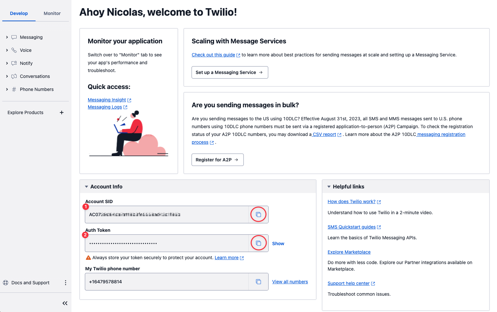
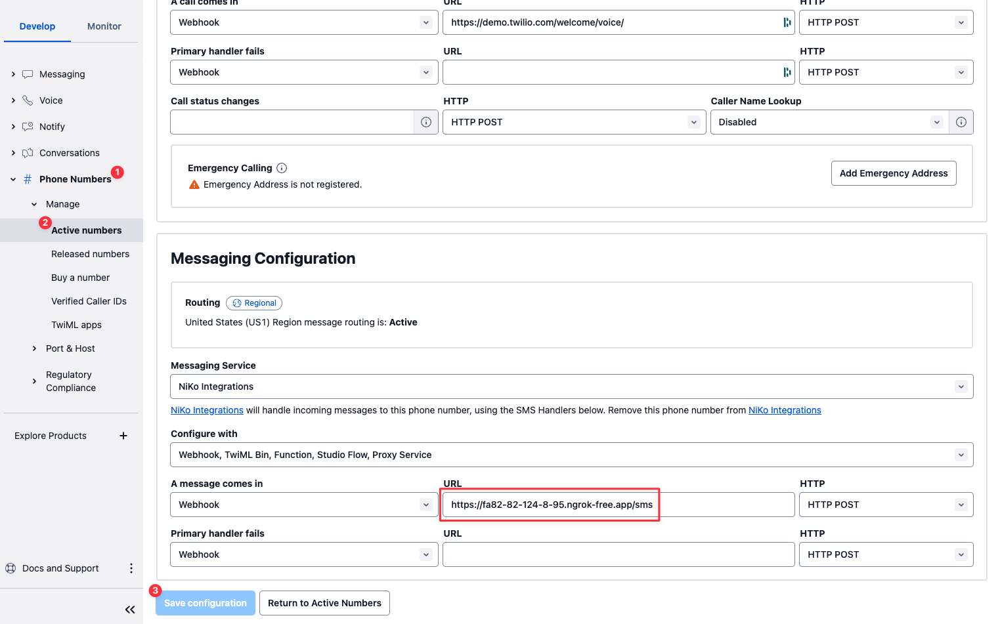

# Voiceflow Twilio SMS Integration

This project is a Voiceflow Twilio SMS Integration using Docker and Docker Compose. It allows you to interact with the Voiceflow general runtime API via SMS using Twilio.

## Features

The application supports the following features:

- Images from Agent: The agent can send images. Please note that support for this feature may vary based on the provider and country.
- Images to Agent: The user can send images to the agent. Again, support for this feature may vary based on the provider and country.
- No Reply Timeout: If the user does not reply within a certain period of time, the application will automatically proceed based on your setting in your Voiceflow agent.

## Project Structure

Here's a brief explanation of the project structure:

- `Dockerfile`: Contains the Docker instructions to build the application image.
- `docker-compose.yml`: Docker Compose configuration for running the application.
- `.env.template`: Environment variables required for the application.
- `package.json`: Contains the application dependencies and scripts.
- `app.js`: The main application file. It sets up the server and defines the routes.
- `api.js`: Contains the Dialog API for interacting with Voiceflow and Twilio.


## App Setup

1. Clone this repository to your local machine.
2. Rename the `.env.template` to `.env` and replace the placeholders with your actual Twilio and Voiceflow credentials.
3. Make sure Docker and Docker Compose are installed on your machine (check bellow for installation instructions).
4. Run the script to build and start the container:

```bash
docker-compose up
```

OR if you have node/npm installed, run the application using the `dev` script defined in `package.json`:

```bash
npm run dev
```

5. If everything went well, and you don't have any errors, next time you can just run:

```bash
docker-compose up -d
```

OR

```bash
  npm start
```

## Usage

Once the application is running, it will listen for incoming SMS messages on the `/sms` route. When a message is received, it will interact with the Voiceflow API and respond back via SMS using Twilio.

## Endpoints

### 1. `/sms` (POST)

This endpoint handles incoming SMS messages from Twilio.

### 2. `/send` (POST)

This new endpoint allows you to send SMS messages directly or through the Voiceflow dialog manager.

#### Payload Structure

```json
{
  "from": "string",
  "to": "string",
  "direct": boolean,
  "payload": {
    "messages": string | string[],
    "userId": "string",
    "action": "string"
  }
}
```

- `from`: The sender's phone number (required)
- `to`: The recipient's phone number (required)
- `direct`: If true, sends the message directly via Twilio. If false, processes it through Voiceflow (required)
- `payload`:
  - `messages`: A single message string or an array of message strings (required)
  - `userId`: User identifier (optional)
  - `action`: Custom action for Voiceflow processing (optional, ignored if `direct` is true)

#### Examples

1. Sending a single message directly:

```json
{
  "from": "+1234567890",
  "to": "+1234567890",
  "direct": true,
  "payload": { "messages": "Hello, world!" }
}
```

2. Sending multiple messages directly:

```json
{
  "from": "+1234567890",
  "to": "+1234567890",
  "direct": true,
  "payload": { "messages": ["Hello, this is the first message.", "And here's a second message!"] }
}
```

## Twilio Setup

To use this application, you will need to set up a Twilio account and obtain your Account SID and Auth Token. These are used to authenticate requests made to the Twilio API.

Here's how to find these in the Twilio console:

1. Log in to your Twilio account.
2. Navigate to the [Twilio Console](https://www.twilio.com/console).
3. On the Dashboard, you will find your Account SID and Auth Token.



Replace the placeholders in the `.env` file with your actual Twilio Account SID and Auth Token.

Next, you need to set up the webhook URL for incoming messages:

1. In the Twilio Console, go to the 'Phone Numbers' section.
2. Select the phone number you want to use.
3. In the 'Messaging' section, find the 'A MESSAGE COMES IN' option.
4. Set the webhook URL to `https://<your_ngrok_url>/sms` for local testing, or your public server URL if deployed on a VPS.
5. Save your changes

Please note that you should use the ngrok URL (`https://<your_ngrok_url>/sms`) when testing the application locally. ngrok exposes your local server to the internet and provides a public URL that can be used for the webhook.

If the application is deployed on a VPS, it will already have a public IP address. In this case, you should use the public server URL (e.g., `http://<your_server_ip>:<port>/sms`) for the webhook.



## Docker Desktop Installation

Before running the application, make sure Docker and Docker Compose are installed on your machine. If not, you can download and install Docker Desktop from the [official Docker website](https://www.docker.com/products/docker-desktop).

For detailed installation instructions, you can refer to the [Docker Desktop Installation Guide](https://docs.docker.com/desktop/install/windows-install/).

## Ngrok Setup (for testing/debug)

When testing locally, you will need to expose your local server to the internet so that Twilio can send webhooks to it. This can be done using ngrok.

1. Download and install ngrok from the [official ngrok website](https://ngrok.com/download).
2. Connect your account using the Auth token provided upon registration.
3. Start a HTTP tunnel on the port where your application is running (e.g., `./ngrok http 3000`).

For detailed instructions, you can refer to the [Ngrok Quickstart Guide](https://ngrok.com/docs/getting-started/).

After starting ngrok, it will provide a forwarding URL that looks like `https://<random_string>.ngrok.io`. This is the public URL that points to your local server.

To get the full endpoint for the Twilio webhook, append the route to this URL. For example, if your application is listening for SMS messages on the `/sms` route, the full URL to be set in Twilio would be `https://<random_string>.ngrok.io/sms`.

You can set this URL as the webhook URL for incoming messages in your Twilio phone number's configuration.

Please note that the free version of ngrok provides a random URL every time you start the tunnel so you might have to update the webhook URL in Twilio accordingly during testing.

## Why Docker?

Docker makes it easier to create, deploy, and run applications by using containers. Containers allow a developer to package up an application with all of the parts it needs, such as libraries and other dependencies, and ship it all out as one package.

In the case of this project, using Docker means you don't have to set up a Node.js environment and install the dependencies on your computer. You just need to have Docker installed, and it will handle the rest, ensuring that the application runs in the same environment regardless of where it is.

## Running on a VPS

If you decide to run this application on a Virtual Private Server (VPS), you can either install Docker on the VPS and run the Docker container there, or you could directly set up a Node.js environment on the VPS and run the application.

When running on a VPS, the application will have a public IP address and you wouldn't need to use ngrok for exposing your local server to the internet. The server running on the VPS is already accessible over the internet.

Here are the general steps to run this on a VPS:

1. SSH into your VPS.
2. Clone the repository to the VPS.
3. Make sure Docker and Docker Compose are installed on the VPS, then run the application using Docker Compose.

Please note that the exact steps can vary based on the VPS provider and the operating system of the VPS.
